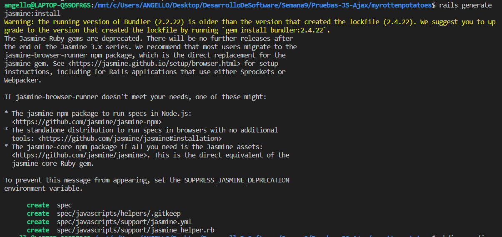

### Testing JavaScript y Ajax
## Configuración inicial
Comencemos configurando Jasmine en nuestro proyecto de Rails para realizar pruebas de JavaScript y Ajax. En el archivo Gemfile, agregamos la gema Jasmine:
```bash
gem 'jasmine'
```
Luego, ejecutamos el comando bundle install para instalar la gema.

```bash
bundle install
```
A continuación, instalamos Jasmine en nuestro proyecto.

```bash
rails generate jasmine:install
```

Creamos una carpeta para los fixtures y la agregamos al control de versiones.

```bash
mkdir spec/javascripts/fixtures
git add spec/javascripts
```
Este conjunto de pasos nos permite configurar Jasmine para realizar pruebas en nuestro proyecto Rails.

## Primeras Pruebas con Jasmine
A continuación, creamos un archivo de prueba básico, ``basic_check_spec.js``, para asegurarnos de que Jasmine esté funcionando correctamente.

```javascript
describe('Jasmine basic check', function() {
    it('works', function() {
        expect(true).toBe(true);
    });
});
```

## Pregunta: ¿Cuáles son los problemas que se tiene cuando se debe probar Ajax? Explica tu respuesta.

Al probar Ajax, nos enfrentamos a varios problemas:

- Asincronía: Las operaciones Ajax son asíncronas, lo que complica la escritura de pruebas y la secuencia de ejecución.

- Dependencia del Servidor: Las pruebas pueden depender del servidor, lo que las hace más lentas y menos confiables.

- Complejidad del Código: La lógica de manejo de Ajax puede ser compleja y difícil de probar, especialmente cuando se trata de llamadas a servicios externos.

## Pregunta: ¿Qué son los stubs, espias y fixture en Jasmine para realizar pruebas de Ajax?

- Stubs: Son funciones o métodos simulados que reemplazan el comportamiento de funciones reales durante las pruebas. En el contexto de pruebas de Ajax, se utilizan para simular llamadas a servicios y controlar su comportamiento.

- Espías: Son funciones que permiten observar el comportamiento de otras funciones durante la ejecución de las pruebas. En el contexto de Ajax, se pueden utilizar para verificar si una función ha sido llamada y con qué argumentos.

- Fixture: Es un conjunto de datos predefinidos que se cargan antes de las pruebas para simular el entorno de la aplicación. En el contexto de Jasmine, los fixtures se utilizan para proporcionar datos simulados, como respuestas de servicios Ajax, durante las pruebas.

## Pregunta: ¿Qué hacen las siguientes líneas del código de la prueba Jasmine para Ajax? ¿Cuál es el papel de spyOn de Jasmine y los stubs en el código dado?

```javascript
it('calls correct URL', function() {
    spyOn($, 'ajax');
    $('#movies a').trigger('click');
    expect($.ajax.calls.mostRecent().args[0]['url']).toEqual('/movies/1');
});

```
En estas líneas:

- ``spyOn($, 'ajax')``: Crea un espía para la función ajax de jQuery. Este espía permite observar si la función ajax se llama y cómo se llama.

- ``$('#movies a').trigger('click')``: Simula el clic en un enlace de películas, lo que debería desencadenar una llamada Ajax.

- ``expect($.ajax.calls.mostRecent().args[0]['url']).toEqual('/movies/1')``: Verifica si la función ajax se llamó con la URL correcta ('/movies/1').

## Pregunta: ¿Qué hacen las siguientes líneas del código de la prueba Jasmine para Ajax?

```javascript
let htmlResponse = readFixtures('movie_info.html');
spyOn($, 'ajax').and.callFake(function(ajaxArgs) { 
    ajaxArgs.success(htmlResponse, '200');
});
$('#movies a').trigger('click');
```

En estas líneas:
- ``let htmlResponse = readFixtures('movie_info.html')``: Se carga un fixture llamado 'movie_info.html', que contiene datos simulados de la respuesta Ajax.

- ``spyOn($, 'ajax').and.callFake(...)``: Se crea un espía para la función ajax y se utiliza callFake para proporcionar una implementación falsa que simula una llamada Ajax exitosa.

- ``$('#movies a').trigger('click')``: Simula el clic en un enlace de películas, lo que debería desencadenar una llamada Ajax.

Estas líneas simulan una llamada Ajax exitosa y controlan su comportamiento, proporcionando una respuesta simulada.

## Pregunta: Dado que Jasmine carga todos los ficheros JavaScript antes de ejecutar ningún ejemplo, la llamada a setup (línea 34 del código siguiente llamado movie_popup.js) ocurre antes de que se ejecuten nuestras pruebas, comprueba que dicha función hace su trabajo y muestra los resultados.

```javascript
var MoviePopup = {
  setup: function() {
    // add hidden 'div' to end of page to display popup:
    let popupDiv = $('<div id="movieInfo"></div>');
    popupDiv.hide().appendTo($('body'));
    $(document).on('click', '#movies a', MoviePopup.getMovieInfo);
  }
  ,getMovieInfo: function() {
    $.ajax({type: 'GET',
            url: $(this).attr('href'),
            timeout: 5000,
            success: MoviePopup.showMovieInfo,
            error: function(xhrObj, textStatus, exception) { alert('Error!'); }
            // 'success' and 'error' functions will be passed 3 args
           });
    return(false);
  }
  ,showMovieInfo: function(data, requestStatus, xhrObject) {
    // center a floater 1/2 as wide and 1/4 as tall as screen
    let oneFourth = Math.ceil($(window).width() / 4);
    $('#movieInfo').
      css({'left': oneFourth,  'width': 2*oneFourth, 'top': 250}).
      html(data).
      show();
    // make the Close link in the hidden element work
    $('#closeLink').click(MoviePopup.hideMovieInfo);
    return(false);  // prevent default link action
  }
  ,hideMovieInfo: function() {
    $('#movieInfo').hide();
    return(false);
  }
};
$(MoviePopup.setup);

```

La función ``setup`` en ``movie_popup.js`` realiza la inicialización necesaria para mostrar información sobre películas. La función crea un div oculto ``(#movieInfo)`` para mostrar la información y establece un evento de clic en enlaces de películas.

```javascript
var MoviePopup = {
    setup: function() {
        let popupDiv = $('<div id="movieInfo"></div>');
        popupDiv.hide().appendTo($('body'));
        $(document).on('click', '#movies a', MoviePopup.getMovieInfo);
    },
};

$(MoviePopup.setup);

```	
Para verificar que esta función hace su trabajo, podemos realizar pruebas que aseguren que el div #movieInfo se crea,se oculta y se adjunta al cuerpo del documento, y que se establece un evento de clic en los enlaces de películas.

```javascript
describe('MoviePopup', function() {
    describe('setup', function() {
        it('adds popup Div to main page', function() {
            MoviePopup.setup();
            expect($('#movieInfo')).toExist();
        });
        it('hides the popup Div', function() {
            MoviePopup.setup();
            expect($('#movieInfo')).toBeHidden();
        });
    });
    // ... otras pruebas para MoviePopup
});

```
En estas líneas:

- ``MoviePopup.setup();``: Se llama a la función setup para realizar la inicialización.

- ``expect($('#movieInfo')).toExist();``: Verifica que el div #movieInfo existe en la página principal.

- ``expect($('#movieInfo')).toBeHidden();``: Verifica que el div #movieInfo está oculto.

Estas pruebas garantizan que la función setup realiza su trabajo correctamente al configurar el entorno necesario para mostrar información sobre películas.

## Pregunta: Indica cuales son los stubs y fixtures disponibles en Jasmine y Jasmine-jQuery.
- ``Stubs en Jasmine``: Los stubs en Jasmine son funciones simuladas que reemplazan el comportamiento de funciones reales durante las pruebas. Jasmine proporciona funciones como jasmine.createSpy para crear stubs.

- ``Fixtures en Jasmine-jQuery``: Jasmine-jQuery proporciona funciones para trabajar con fixtures. Algunas funciones comunes son loadFixtures para cargar datos simulados y readFixtures para leer datos de fixtures.
## Pregunta: Como en RSpec, Jasmine permite ejecutar código de inicialización y desmantelamiento de pruebas utilizando ``beforeEach`` y ``afterEach``. El código de inicialización carga el fixture HTML mostrado en el código siguiente, para imitar el entorno que el manejador ``getMovieInfo`` vería si fuera llamado después de mostrar la lista de películas.
```javascript
<div id="movies">
    <div class="row">
        <div class="col-8"><a href="/movies/1">Casablanca</a></div>
        <div class="col-2">PG</div>
        <div class="col-2">1943-01-23</div>
    </div>
</div>

```	

Este código HTML representa un fixture utilizado para simular la lista de películas en el entorno de prueba.
se oculta y se adjunta al cuerpo del documento, y que se establece un evento de clic en los enlaces de películas.

```javascript
Copy code
describe('MoviePopup', function() {
    describe('setup', function() {
        it('adds popup Div to main page', function() {
            MoviePopup.setup();
            expect($('#movieInfo')).toExist();
        });
        it('hides the popup Div', function() {
            MoviePopup.setup();
            expect($('#movieInfo')).toBeHidden();
        });
    });
});
```
En estas líneas:

- ``MoviePopup.setup();``: Se llama a la función setup para realizar la inicialización.

- ``expect($('#movieInfo')).toExist();``: Verifica que el div #movieInfo existe en la página principal.

- ``expect($('#movieInfo')).toBeHidden();``: Verifica que el div #movieInfo está oculto.

Estas pruebas garantizan que la función setup realiza su trabajo correctamente al configurar el entorno necesario para mostrar información sobre películas.

## Pregunta: Indica cuales son los stubs y fixtures disponibles en Jasmine y Jasmine-jQuery.

- ``Stubs en Jasmine:`` Los stubs en Jasmine son funciones simuladas que reemplazan el comportamiento de funciones reales durante las pruebas. Jasmine proporciona funciones como jasmine.createSpy para crear stubs.

- ``Fixtures en Jasmine-jQuery:`` Jasmine-jQuery proporciona funciones para trabajar con fixtures. Algunas funciones comunes son loadFixtures para cargar datos simulados y readFixtures para leer datos de fixtures.

## Pregunta: Como en RSpec, Jasmine permite ejecutar código de inicialización y desmantelamiento de pruebas utilizando beforeEach y afterEach. El código de inicialización carga el fixture HTML mostrado en el código siguiente, para imitar el entorno que el manejador getMovieInfo vería si fuera llamado después de mostrar la lista de películas.

```html
<div id="movies">
    <div class="row">
        <div class="col-8"><a href="/movies/1">Casablanca</a></div>
        <div class="col-2">PG</div>
        <div class="col-2">1943-01-23</div>
    </div>
</div>
```
``Jasmine``, al igual que RSpec, permite la ejecución de código de inicialización y desmantelamiento de pruebas mediante las funciones beforeEach y afterEach. En el contexto de pruebas de Ajax, es común utilizar estas funciones para establecer un entorno controlado. A continuación, se muestra un ejemplo de código HTML utilizado como fixture:

Este fixture se carga dentro del elemento ``div#jasmine-fixtures``, que reside en div#jasmine_content en la página principal de ``Jasmine``. La eliminación de todos los fixtures después de cada especificación (spec) preserva la independencia de las pruebas.

## 1.Manejo de Herencia de Prototipos:
Se abordó el inconveniente de que todos los atributos de objetos son públicos en la herencia de prototipos. Se propuso utilizar clausuras para obtener atributos privados. Se creó un constructor para objetos User que acepta un nombre de usuario y una contraseña, proporcionando un método checkPassword que verifica la contraseña sin permitir la inspección directa de la misma.

```javascript
function User(username, password) {
  let privatePassword = password;

  this.checkPassword = function (inputPassword) {
    return privatePassword === inputPassword;
  };
}
```
## 2.Identificación de Filas Ocultas:
Ante la imposibilidad de modificar el código del servidor para agregar una clase CSS, se planteó la identificación de filas ocultas en la tabla movies utilizando solo código JavaScript del lado cliente. La estrategia propuesta se basa en la detección de elementos ocultos mediante propiedades del DOM.

```javascript
const hiddenRows = Array.from(document.querySelectorAll('.row.hidden'));
```

## 3. Código AJAX para Menús en Cascada:
Se solicitó escribir código AJAX para crear menús en cascada basados en una asociación has_many entre los modelos de Rails A y B. El primer menú debe listar opciones de A, y al seleccionar una opción, se deben devolver y mostrar las opciones correspondientes de B en el segundo menú.

```javascript
$.ajax({
  url: '/model_a_options',
  method: 'GET',
  success: function(optionsA) {
    // Rellenar el primer menú con opcionesA
    $('#menuA').change(function() {
      const selectedOptionA = $(this).val();
      // Hacer otra solicitud AJAX para obtener las opciones correspondientes de B
      $.ajax({
        url: '/model_a_options/' + selectedOptionA + '/model_b_options',
        method: 'GET',
        success: function(optionsB) {
        },
        error: function() {
        }
      });
    });
  },
});
```
Este código presupone la existencia de rutas en el servidor para gestionar las solicitudes AJAX y devolver las opciones correspondientes de los modelos A y B.

## 4. Extensión de Validación en ActiveModel
Extender la función de validación en ActiveModel para generar código JavaScript implica la creación dinámica de scripts que utilicen las validaciones definidas en el modelo. Tomando como ejemplo un modelo Movie en Rails con ciertas validaciones:

```ruby
class Movie < ApplicationRecord
  validates :title, presence: true, uniqueness: true
  validates :release_date, numericality: { only_integer: true, greater_than: 1900 }
end
```

